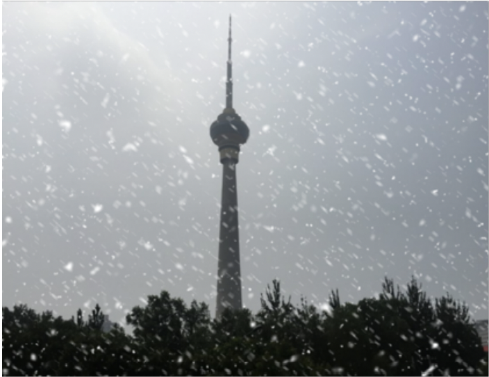

## 标题1
### 标题2
正文 

正常文本 example text

斜体 _italic_

粗体**bold**

代码`code`

表格
|  默认左对齐    |  左对齐    |   居中   | 右对齐 |
| ---- | :--- | :--: | ---: |
|   a   |   b   |   c   | d |
|   e   |   f   |   g   | h |

无序列表
- 1
    - 111
        - 111
- 2

有序列表
1. dskfmk
2. dsf


代码
```python
import torch.nn as nn

class Main(nn.Module){
    def __init__()
  	    self.super().__init()
    def forward(self):
        pass
}
```

公式
$$ \alpha + \beta = \gamma$$

图片
<!--  -->
